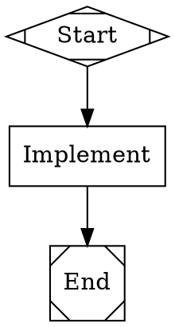
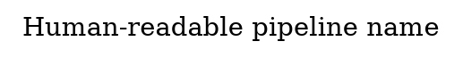
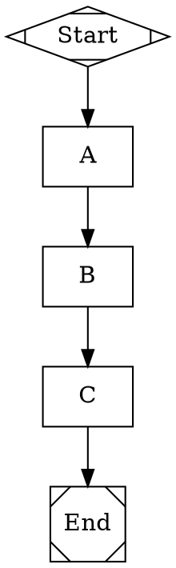
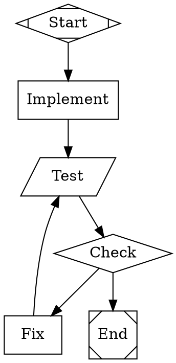
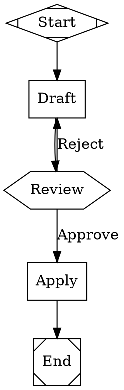
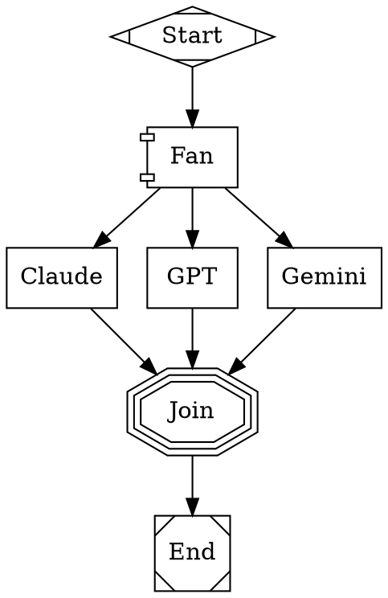

# Klaus

A TypeScript implementation of the [Attractor](https://github.com/strongdm/attractor) software factory system. Klaus provides a DOT-based pipeline runner for orchestrating multi-stage AI workflows, a programmable coding agent loop for autonomous code generation, and a unified LLM client supporting Anthropic, OpenAI, and Gemini.

## What is Klaus?

Klaus is a software factory. You describe a workflow as a [Graphviz DOT](https://graphviz.org/doc/info/lang.html) file — nodes are tasks, edges are transitions — and Klaus executes it. Each node can be an LLM-powered coding agent, a shell command, a human approval gate, a conditional branch, or a parallel fan-out. The pipeline engine walks the graph from start to exit, running handlers at each node, routing along edges based on outcomes and conditions.

Klaus integrates with [Claude Code](https://claude.com/claude-code) via skills. You can plan a sprint, generate a `.dot` pipeline, and execute it — all from within your AI coding environment.

## How It Works

The typical workflow:

1. **Open Claude Code** in the project you want to work on
2. **Plan the work** — use the `sprint-plan` skill to analyze your project, generate a plan, and produce a `.dot` pipeline file
3. **Execute the pipeline** — use `klaus run` to walk the graph, running each node through the appropriate handler (LLM agent, shell command, human gate, etc.)
4. **Review and iterate** — human gates in the pipeline let you approve, reject, or redirect at key decision points

```
You describe the work
        |
        v
  sprint-plan skill generates a .dot pipeline
        |
        v
  klaus run executes the pipeline
        |
        v
  ┌─────────────────────────────────────────┐
  │  Start                                  │
  │    ↓                                    │
  │  Plan (LLM analyzes codebase)           │
  │    ↓                                    │
  │  Review (human approves/rejects)        │
  │    ↓                                    │
  │  Implement (LLM writes code)            │
  │    ↓                                    │
  │  Test (shell: pnpm test)                │
  │    ↓                                    │
  │  Fix loop if tests fail                 │
  │    ↓                                    │
  │  End                                    │
  └─────────────────────────────────────────┘
```

## Quick Start

### Prerequisites

- Node.js >= 22
- pnpm
- At least one LLM API key: `ANTHROPIC_API_KEY`, `OPENAI_API_KEY`, or `GEMINI_API_KEY`

### Install and Build

```bash
git clone <this-repo> && cd klaus
pnpm install
pnpm build
```

### Install Skills

Klaus uses [Claude Code skills](https://github.com/strongdm/skills) for sprint planning and execution. Install them into your project:

```bash
# From within your project directory:
pnpm klaus skills install

# Or manually:
npx skills add strongdm/skills
```

This installs two skills into `.claude/skills/`:

| Skill | What it does |
|-------|-------------|
| `sprint-plan` | Multi-agent sprint planning with competitive drafting across Claude, Codex, and Gemini. Produces an implementation plan and a `.dot` pipeline file. |
| `sprint-execute` | Executes a sprint document phase-by-phase with build/test validation at each step. |

### Run a Pipeline

```bash
# Set your API key(s)
export ANTHROPIC_API_KEY=sk-ant-...

# Validate a pipeline file
pnpm klaus validate pipelines/quick-start.dot

# Run a pipeline
pnpm klaus run pipelines/quick-start.dot

# Run with options
pnpm klaus run pipelines/plan-and-execute.dot \
  --model claude-sonnet-4-5-20250929 \
  --auto-approve
```

## CLI Reference

```
klaus [command] [options]

Commands:
  run <file.dot>       Run a DOT pipeline
  validate <file.dot>  Validate a DOT pipeline file
  skills check         Check if required skills are installed
  skills install       Install skills from strongdm/skills
```

### `klaus run`

Execute a DOT pipeline from start to exit.

| Option | Default | Description |
|--------|---------|-------------|
| `-m, --model <model>` | Provider default | LLM model for codergen nodes (each provider has a built-in default; per-node `llm_model` overrides this) |
| `--auto-approve` | `false` | Skip human approval gates (auto-approve all) |
| `--logs <dir>` | `/tmp/klaus-logs` | Directory for pipeline execution logs |
| `-q, --quiet` | `false` | Suppress event logging output |

The engine prints events as the pipeline runs:

```
[12:34:56] Pipeline started: PlanAndExecute
[12:34:56] -> Start
[12:34:56]    done (1ms)
[12:34:56] -> Plan
[12:35:12]    done (16204ms)
[12:35:12] -> Review
[12:35:18]    done (5801ms)
[12:35:18] -> Implement
[12:36:45]    done (87102ms)
[12:36:45] -> Test
[12:36:52]    done (6891ms)

[12:36:52] Pipeline completed (116002ms)
```

### `klaus validate`

Parse and validate a `.dot` file without executing it. Reports errors and warnings:

- Missing start or exit node
- Unreachable nodes
- Invalid edge conditions
- Codergen nodes missing prompts
- Multiple start/exit nodes

### `klaus skills`

Manage Claude Code skill installation.

- `klaus skills check` — reports which skills are installed and which are missing
- `klaus skills install` — runs `npx skills add strongdm/skills` to install sprint-plan and sprint-execute

## Writing Pipeline Files

Pipeline files use [Graphviz DOT](https://graphviz.org/doc/info/lang.html) syntax with custom attributes. A pipeline is a `digraph` with nodes (tasks) and edges (transitions).

### Minimal Example



### Node Types

Nodes are typed by their `shape` attribute. Each shape maps to a built-in handler:

| Shape | Type | What it does |
|-------|------|-------------|
| `Mdiamond` | `start` | Entry point. Every pipeline needs exactly one. |
| `Msquare` | `exit` | Exit point. Every pipeline needs exactly one. |
| `box` | `codergen` | LLM coding agent. Reads the `prompt` attribute, calls the LLM with full tool access (read/write/edit/shell/grep/glob). This is where code gets written. |
| `parallelogram` | `tool` | Shell command. Reads the `tool_command` attribute and executes it. Use for running tests, linters, build commands. |
| `hexagon` | `wait.human` | Human gate. Presents the outgoing edge labels as choices and waits for input. Use for approval steps. |
| `diamond` | `conditional` | Conditional router. Does nothing itself — the engine evaluates `condition` attributes on outgoing edges to pick the next node. |
| `component` | `parallel` | Parallel fan-out. All outgoing edges execute concurrently. |
| `tripleoctagon` | `parallel.fan_in` | Fan-in join. Waits for parallel branches to complete, merges results. |
| `house` | `stack.manager_loop` | Supervisor pattern for iterative refinement. |

You can also set the type explicitly with the `type` attribute: `MyNode [type="codergen", prompt="..."]`.

### Node Attributes

| Attribute | Applies to | Description |
|-----------|-----------|-------------|
| `prompt` | `codergen` | The instruction sent to the LLM. Use `$goal` to reference the pipeline's graph-level goal. |
| `tool_command` | `tool` | Shell command to execute. |
| `timeout` | `tool` | Command timeout. Supports `ms`, `s`, `m`, `h`, `d` suffixes. Default: `30s`. |
| `llm_model` | `codergen` | Override the LLM model for this node. E.g., `llm_model="claude-opus-4-6"`. Any model string is passed through to the provider API. |
| `llm_provider` | `codergen` | Override the LLM provider. |
| `max_retries` | any | Number of retry attempts if the node fails. |
| `max_parallel` | `parallel` | Max concurrent branches. Default: unlimited. E.g., `max_parallel=2`. |
| `fidelity` | `codergen` | How much prior context to include. Values: `full`, `truncate` (400 chars), `compact` (3200, default), `summary:low` (2400), `summary:medium` (6000), `summary:high` (12000). |
| `thread_id` | `codergen` | Nodes sharing the same `thread_id` reuse the same LLM session, preserving conversation history across nodes. |
| `goal_gate` | any | If `true`, this node must complete successfully before the pipeline can exit. |
| `label` | any | Display label. For `wait.human`, shown as the prompt text. |

### Edge Attributes

| Attribute | Description |
|-----------|-------------|
| `condition` | Expression that must evaluate to true for this edge to be taken. See Condition Expressions below. |
| `label` | Edge label. Used for preferred-label matching and displayed in human gates. |
| `weight` | Numeric tiebreaker. Higher weight = preferred when multiple edges match. |
| `fidelity` | Override fidelity for the target node (takes precedence over node-level fidelity). |
| `thread_id` | Associate this transition with a conversation thread. |

### Condition Expressions

Conditions on edges control routing. The engine evaluates them against the pipeline context and the last node's outcome.

```dot
// Route based on outcome status
NodeA -> NodeB [condition="outcome=success"]
NodeA -> NodeC [condition="outcome=fail"]

// Route based on context values
Check -> Deploy [condition="context.quality=high"]
Check -> Fix [condition="context.quality=low"]

// Route based on preferred label from human gates
Review -> Implement [label="Approve"]
Review -> Plan [label="Reject", condition="preferred_label=Reject"]

// Combine with && (AND)
Gate -> Deploy [condition="outcome=success && context.tests_pass=true"]
```

Supported operators: `=` (equals), `!=` (not equals), `~=` (contains), `!~=` (not contains), `&&` (and).

```dot
// Contains / not contains — useful for checking LLM output
Gate -> End [condition="context.ConsensusCheck.response~=CONSENSUS_REACHED"]
Gate -> Fix [condition="context.ConsensusCheck.response!~=CONSENSUS_REACHED"]
```

### Edge Selection Algorithm

When a node completes, the engine picks the next edge using a 5-step priority:

1. **Condition match** — first edge whose `condition` evaluates to true
2. **Preferred label** — match the outcome's `preferred_label` to an edge's `label`
3. **Suggested next IDs** — match the outcome's `suggested_next_ids` to edge targets
4. **Weight** — highest `weight` attribute wins
5. **Lexical** — alphabetical by target node ID (final tiebreak)

### Graph-Level Attributes

Set these on the `graph` to configure the whole pipeline:



| Attribute | Description |
|-----------|-------------|
| `goal` | The pipeline's objective. Available as `$goal` in node prompts and as `graph.goal` in the context. |
| `label` | Display name for the pipeline. |
| `default_max_retries` | Default retry count for all nodes (can be overridden per-node). |
| `model_stylesheet` | CSS-like model configuration. See Model Stylesheets below. |
| `default_fidelity` | Default fidelity mode for context passing between nodes. |

### Chained Edges

You can chain edges for linear sequences:

```dot
Start -> Plan -> Implement -> Test -> End
```

This creates edges: Start->Plan, Plan->Implement, Implement->Test, Test->End.

## Included Pipelines

Klaus ships with three starter pipelines in `pipelines/`:

### `quick-start.dot`

The simplest pipeline. Three LLM nodes in sequence:

```
Start -> Plan -> Implement -> Verify -> End
```

Use this to get started or as a template for simple tasks.

### `plan-and-execute.dot`

A full development workflow with human review and test validation:

```
Start -> Plan -> Review (human) -> Implement -> Test -> Lint -> CheckResults -> End
                   |                                              |
                   <- Reject                                Fix <-
```

- **Plan**: LLM analyzes the codebase and creates an implementation plan
- **Review**: Human approves or rejects the plan (loops back to Plan on reject)
- **Implement**: LLM executes the plan (marked as a goal gate)
- **Test + Lint**: Shell commands run the test suite and linter
- **Fix loop**: If tests or lint fail, an LLM agent fixes the issues and re-runs

### `multi-model-review.dot`

Implementation with cross-model code review:

```
Start -> Implement (Claude) -> Review (Claude) -> Test -> Check -> End
                                                           |
                                                     Fix <-
```

- **Implement**: Primary implementation with a specified model
- **Review**: A second model reviews the code for bugs, security issues, and style
- **Test gate**: Shell command runs tests, loops through Fix if they fail

### `consensus-loop.dot`

Multi-model consensus loop — fan out to three models, critique, synthesize, and loop until unanimous agreement:

```
Start -> Plan -> FanOut -> [DraftClaude, DraftGPT, DraftGemini] -> CollectDrafts
  -> Critique -> Synthesize -> ConsensusCheck -> Gate
                                                   |
                    Gate -> End (if CONSENSUS_REACHED)
                    Gate -> Fix -> Test -> ConsensusCheck (loop)
```

- **FanOut**: Parallel fan-out to three branches, each using a different model (`claude-sonnet-4-5-20250929`, `gpt-4o`, `gemini-2.0-flash`)
- **Critique**: Reviews all three drafts side-by-side, identifies the best approach
- **Synthesize**: Merges the best ideas into a unified implementation
- **ConsensusCheck**: Verifies correctness, completeness, and quality — responds `CONSENSUS_REACHED` or lists issues
- **Loop**: If consensus not reached, Fix addresses issues, Test validates, and the loop continues

## Packages

Klaus is a pnpm monorepo with four packages:

| Package | Description |
|---------|-------------|
| [`@klaus/cli`](packages/cli) | CLI for running and validating pipelines, managing skills |
| [`@klaus/pipeline`](packages/pipeline) | DOT parser, execution engine, built-in handlers, validation |
| [`@klaus/agent-loop`](packages/agent-loop) | Coding agent loop with provider-aligned profiles and tools |
| [`@klaus/llm-client`](packages/llm-client) | Unified LLM client for Anthropic, OpenAI, and Gemini |

Dependencies flow in one direction: `cli` -> `pipeline` -> `agent-loop` -> `llm-client`.

### @klaus/llm-client

Provider-agnostic LLM client. Each provider uses its native API — Anthropic Messages API, OpenAI Responses API, Gemini native API — with a unified `Request`/`Response`/`StreamEvent` interface.

```ts
import { Client, generate, stream, generate_object } from "@klaus/llm-client";

const client = Client.fromEnv();

// Simple completion
const response = await client.complete({
  model: "claude-sonnet-4-5-20250929",
  messages: [{ role: "user", content: [{ kind: "text", text: "Hello" }] }],
});

// High-level generate with tool execution loop
const result = await generate({
  client,
  model: "claude-sonnet-4-5-20250929",
  prompt: "What's the weather in SF?",
  tools: [{
    name: "get_weather",
    description: "Get weather for a location",
    parameters: {
      type: "object",
      properties: { location: { type: "string" } },
      required: ["location"],
    },
    execute: async (args) => JSON.stringify({ temp: 72, condition: "sunny" }),
  }],
});

// Streaming
const s = stream({ client, model: "gemini-2.0-flash", prompt: "Count to 5" });
for await (const text of s.text_stream) {
  process.stdout.write(text);
}

// Structured output with Zod validation
import { z } from "zod";
const obj = await generate_object({
  client,
  model: "gpt-4o-mini",
  prompt: "Extract: John is 30 years old",
  schema: z.object({ name: z.string(), age: z.number() }),
});
console.log(obj.output); // { name: "John", age: 30 }
```

**Provider routing** — the client routes automatically based on model name:

| Pattern | Provider |
|---------|----------|
| `claude-*` | Anthropic |
| `gpt-*`, `o1-*`, `o3-*` | OpenAI |
| `gemini-*` | Gemini |

Or set `provider` explicitly on any request.

**Features**: unified types, automatic tool call loop with `Promise.allSettled`, `generate_object()` / `stream_object()` with Zod, retry with exponential backoff + jitter + Retry-After, composable onion-model middleware, per-provider default models with runtime override, ESM + CJS output.

### @klaus/agent-loop

Programmable coding agent loop. The host application controls session lifecycle, observes events, steers mid-task, and composes subagents.

```ts
import { Session, LocalExecutionEnvironment, createAnthropicProfile } from "@klaus/agent-loop";
import { Client } from "@klaus/llm-client";

const client = Client.fromEnv();
const env = new LocalExecutionEnvironment("/path/to/project");
await env.initialize();

const session = new Session({
  profile: createAnthropicProfile("claude-sonnet-4-5-20250929"),
  client,
  environment: env,
  config: { max_turns: 10 },
});

await session.process_input("Add error handling to the API routes");
session.close();
```

**Provider profiles** align tools and system prompts to each provider's native agent:

| Profile | Aligned to | Tools |
|---------|-----------|-------|
| Anthropic | Claude Code | read_file, write_file, edit_file, shell, grep, glob |
| OpenAI | codex-rs | read_file, write_file, apply_patch, shell, grep, glob |
| Gemini | gemini-cli | read_file, write_file, edit_file, shell, grep, glob |

**Features**: 7 built-in tools, character-first then line-based output truncation, loop detection (repeating pattern window of 10), steering and follow-up message injection, typed event system with async iterator, sandboxed execution environment with process groups.

### @klaus/pipeline

DOT-based pipeline runner. Parses Graphviz DOT syntax into an executable graph and walks it from start to exit.

```ts
import { PipelineEngine } from "@klaus/pipeline";

const engine = new PipelineEngine({
  dot: fs.readFileSync("pipeline.dot", "utf-8"),
  backend: myCodergenBackend,
  interviewer: myInterviewer, // optional, defaults to auto-approve
  on_event: (event) => console.log(event.kind),
});

const outcome = await engine.run();
// outcome.status: "success" | "fail" | "partial_success" | "retry" | "skipped"
```

**The `CodergenBackend` interface** is how the engine calls LLMs:

```ts
interface CodergenBackend {
  run(node: Node, prompt: string, context: PipelineContext): Promise<string | Outcome>;
}
```

The CLI's built-in backend creates an `@klaus/agent-loop` Session for each codergen node, giving each node full tool access (file I/O, shell, grep, glob). Nodes sharing a `thread_id` reuse the same session for conversation continuity.

**The `Interviewer` interface** handles human-in-the-loop gates:

```ts
interface Interviewer {
  ask(question: Question): Promise<Answer>;
  inform?(message: string, stage: string): Promise<void>;
}
```

The CLI provides a `ConsoleInterviewer` (reads from stdin) and an auto-approve mode.

**Features**: full DOT parser with attributes/subgraphs/chained edges, 9 built-in handlers, 5-step edge selection, model stylesheets, condition expressions (`=`, `!=`, `~=`, `!~=`), fidelity system for context passing, parallel fanout with isolated contexts and concurrency control, retry with exponential backoff + jitter, checkpoint serialization for pause/resume, graph validation, event stream.

## Architecture

```
┌──────────────────────────────────────────────────────────────────┐
│  @klaus/cli                                                      │
│  CLI entry point — run, validate, skills                         │
├──────────────────────────────────────────────────────────────────┤
│  @klaus/pipeline                                                 │
│  DOT parser | Execution engine | Handlers | Validation           │
├──────────────────────────────────────────────────────────────────┤
│  @klaus/agent-loop                                               │
│  Session | Provider profiles | Tool registry | Truncation        │
├──────────────────────────────────────────────────────────────────┤
│  @klaus/llm-client                                               │
│  Client | Adapters (Anthropic, OpenAI, Gemini) | Middleware      │
│  generate() | stream() | generate_object() | Retry               │
└──────────────────────────────────────────────────────────────────┘
```

## Using Klaus with Claude Code

The most common way to use Klaus is through Claude Code with the installed skills.

### Planning a Sprint

Open Claude Code in your project and describe what you want to build. The `sprint-plan` skill will:

1. Orient to your project's current state (codebase, git history, open issues)
2. Generate competitive drafts from multiple models (Claude, Codex, Gemini)
3. Cross-critique each draft
4. Interview you to resolve ambiguities
5. Produce a final sprint document and a `.dot` pipeline file

### Executing a Sprint

Once you have a sprint document or `.dot` file, the `sprint-execute` skill will work through it phase-by-phase with build/test validation gates.

Alternatively, run the pipeline directly:

```bash
pnpm klaus run my-sprint.dot
```

### Writing Custom Pipelines

You can write `.dot` files by hand or have Claude generate them. Here's a template for common patterns:

**Linear pipeline** (do A, then B, then C):



**Pipeline with test gate** (implement, test, fix loop):



**Pipeline with human approval**:



**Multi-model parallel fanout** (fan out to multiple models, join results):



Each branch runs concurrently with an isolated context. After all branches complete, the fan-in node merges results. Branch outputs are available as `${Claude.response}`, `${GPT.response}`, etc. in downstream prompts.

## Development

```bash
pnpm install       # Install dependencies
pnpm build         # Build all packages
pnpm test          # Run unit tests
pnpm lint          # Lint with Biome
pnpm format        # Format with Biome
pnpm klaus         # Run the CLI (after build)
```

### Tech Stack

| Concern | Choice |
|---------|--------|
| Language | TypeScript (strict mode, ES2023 target) |
| Runtime | Node.js >= 22 |
| Package manager | pnpm workspaces |
| Build | tsup (ESM + CJS) |
| Test | Vitest |
| Lint/Format | Biome |
| HTTP | Native fetch |
| Validation | Zod |

### Repository Structure

```
klaus/
  packages/
    cli/              # CLI entry point
      src/
        cli.ts              # Commander.js CLI (run, validate, skills)
        backend.ts          # CodergenBackend using agent-loop Session
        console-interviewer.ts  # Interactive stdin/stdout interviewer
        skills.ts           # Skill detection and installation
    pipeline/         # DOT parser and execution engine
      src/
        parser.ts           # DOT syntax parser
        engine.ts           # Pipeline execution engine
        handlers.ts         # 9 built-in node handlers
        validation.ts       # Graph validation and lint rules
        conditions.ts       # Condition expression evaluator
        fidelity.ts         # Fidelity system for context passing
        context.ts          # Shared key-value context
        stylesheet.ts       # Model stylesheet parser
        transforms.ts       # Post-parse graph transforms
        types.ts            # All pipeline types
    agent-loop/       # Coding agent loop
      src/
        session.ts          # Session orchestrator and agentic loop
        environment.ts      # LocalExecutionEnvironment
        events.ts           # Typed event emitter + async iterator
        truncation.ts       # Output truncation (char + line)
        loop-detection.ts   # Repeating pattern detection
        steering.ts         # Steering and follow-up queues
        tools/              # Tool implementations
        profiles/           # Provider-aligned profiles
    llm-client/       # Unified LLM client
      src/
        client.ts           # Core Client class
        types.ts            # Request, Response, Message, etc.
        adapters/           # Anthropic, OpenAI, Gemini adapters
        generate.ts         # High-level generate/stream/generate_object
        retry.ts            # Retry with exponential backoff
        middleware.ts       # Onion-model middleware
  pipelines/          # Starter pipeline files
    quick-start.dot
    plan-and-execute.dot
    multi-model-review.dot
    consensus-loop.dot
```

### Versioning and Releases

Klaus uses [changesets](https://github.com/changesets/changesets) for version management and GitHub Releases for distribution.

```bash
pnpm changeset              # Create a changeset describing your changes
pnpm version-packages       # Apply changesets to bump versions and update changelogs
git tag v0.2.0 && git push --tags   # Tag triggers the release workflow
```

Pushing a `v*` tag triggers the GitHub Actions release workflow, which builds, tests, and publishes tarballs + SHA256 checksums to GitHub Releases. CI runs on every push and PR to `main`.

## Upstream Specs

Klaus implements three NLSpecs from the [Attractor](https://github.com/strongdm/attractor) project:

1. [Unified LLM Client Spec](https://github.com/strongdm/attractor/blob/main/unified-llm-spec.md) — `@klaus/llm-client`
2. [Coding Agent Loop Spec](https://github.com/strongdm/attractor/blob/main/coding-agent-loop-spec.md) — `@klaus/agent-loop`
3. [Attractor Spec](https://github.com/strongdm/attractor/blob/main/attractor-spec.md) — `@klaus/pipeline`

## License

See [LICENSE](LICENSE).
